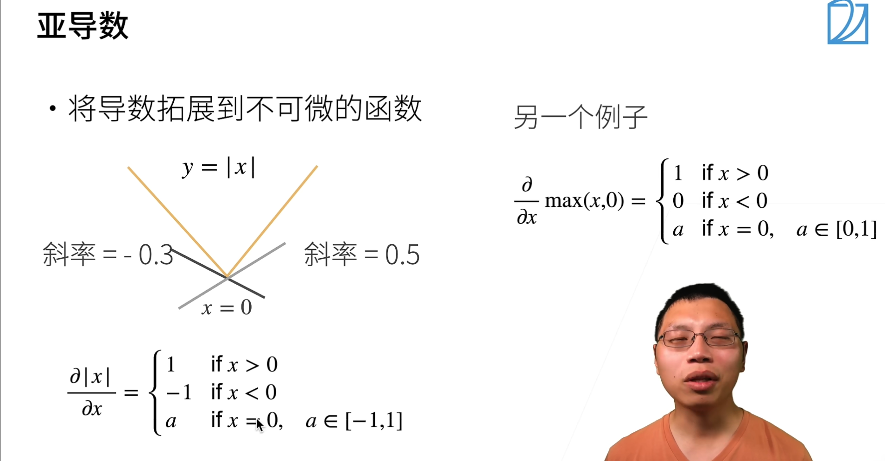
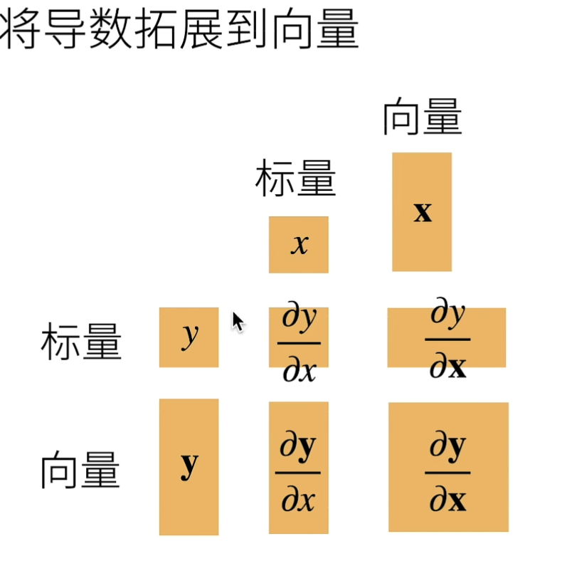
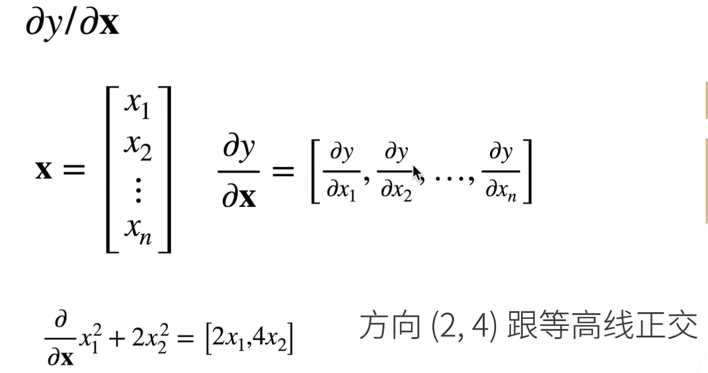
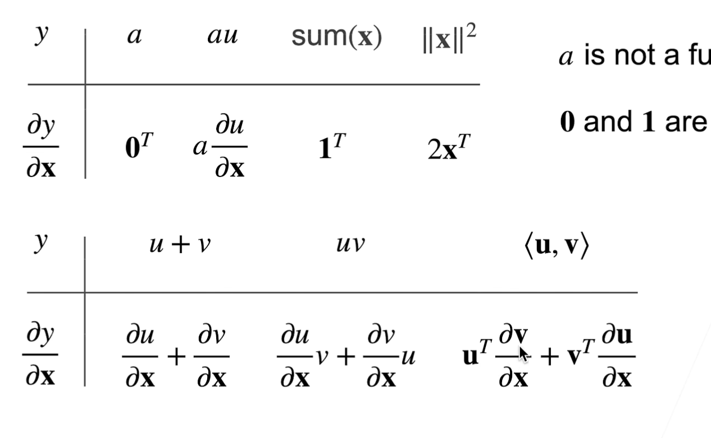
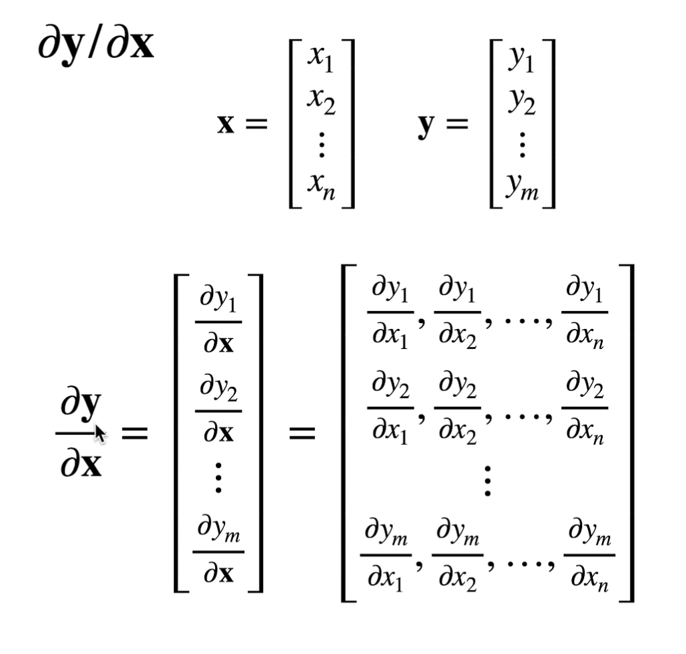
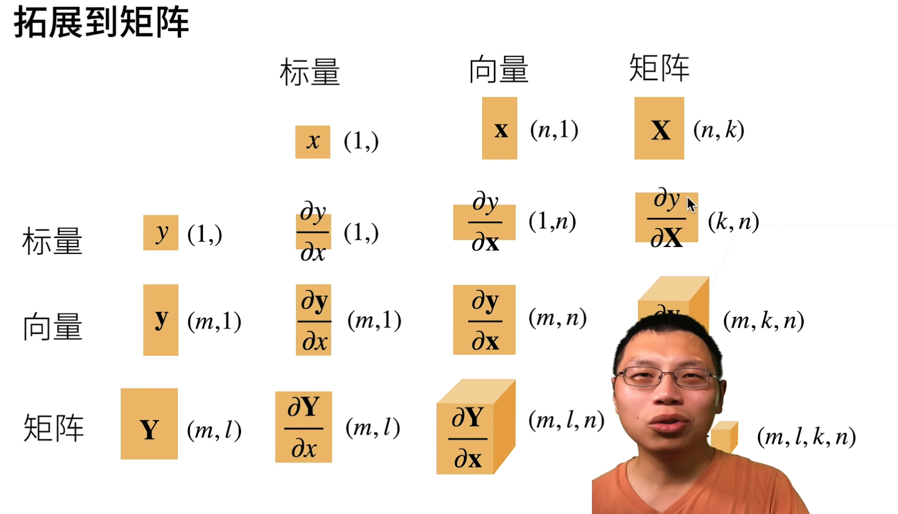

#### 亚导数

#### 梯度

- 创建一个Tensor时，使用requires_grad参数指定是否记录对其的操作，以便之后利用backward()方法进行梯度求解。
- 一个Tensor的requires_grad成员保存该Tensor是否记录操作用于计算梯度。
- 可利用requires_grad_()方法修改Tensor的requires_grad属性（in place）。
- 通过运算创建的Tensor，会自动被赋值grad_fn属性。该属性表示梯度函数。
- 最后得到的Tensor执行自身的backward()函数，此时之前参与运算并生成当前Tensor的叶子（leaf）Tensor将会保存其梯度在叶子Tensor的**grad属性**中。backward()函数接受参数，表示在特定位置求梯度值，该参数应和调用backward()函数的Tensor的维度相同，或者是可broadcast的维度。默认为torch.tensor(1)，也就是在当前梯度为标量1的位置求叶子Tensor的梯度。
- 默认同一个运算得到的Tensor**仅能进行一次**backward()。再次运算得到的Tesnor，可以再次进行backward()。
  当多个Tensor从相同的源Tensor运算得到，这些运算得到的Tensor的backwards()方法将向源Tensor的grad属性中进行数值累加。
  